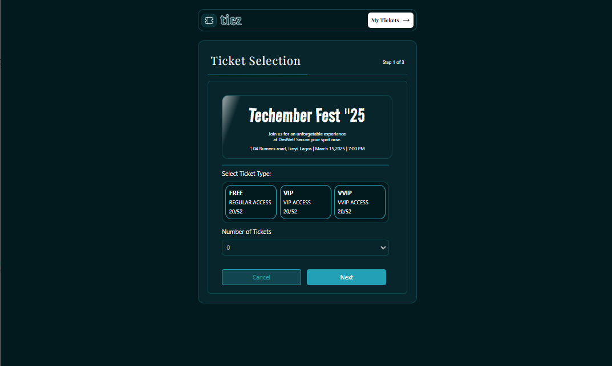
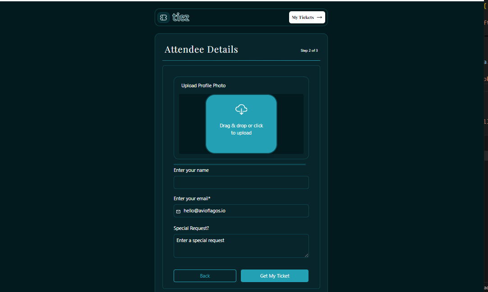
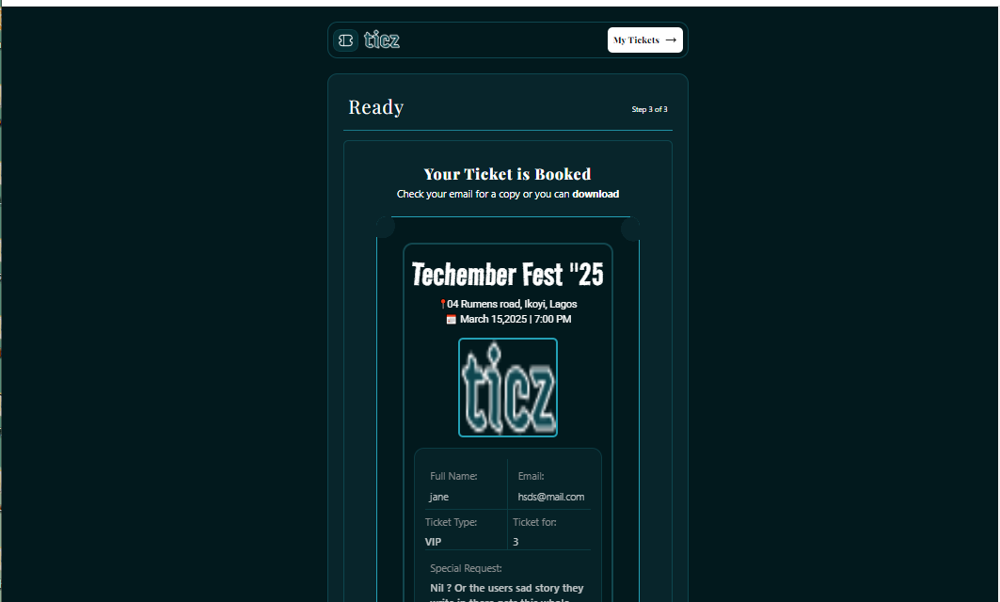

# Conference Ticket Generator

## Overview

This project is for promotion into stage 3 for the HNG Internship Cohort 12. This conference Ticket Generator will allow users to fill out a form with their details, perform validations on the inputs, and generate a ticket upon successful submission.

## Features

- **Form Elements:** These elements are full name, email address, avatar upload, and a sub, it button.
- **Form Validation:** This ensures all required fields are filled in before submission.
- **State Persistence:** The form should be able to retain user inputs using local storage so that the data is not lost on page refresh.
- **Accessibility:** This ensures that all form fields, hints, and error messages are screen-reader accessible.
- **Ticket Generation:** On successful submission, the conference ticket is generated and displayed with the attendee's details.
- **Responsive Design:** The form and ticket layout adjust seamlessly across different screen sizes.

## Installation

1. Clone the repository: ```javascript git clone https://github.com/Nkwor-Jane/conference_ticket_generator.gitt```

2. Navigate to the project directory: ```javascript cd conference_ticket_generator```

3. Install dependencies:```javascript npm install```

## Usage

1. Start the development server: ```javascript npm run dev```

2. Open your browser and navigate to: ```javascript http://localhost:5173/```

## Main Components

1. **TicketList.jsx:** This renders the ticket type and number of tickets
2. **AttendeeForm.jsx:** This accepts information about the attendee.
3. **SuccessScreen.jsx:** This displays the generated ticket.

## Screenshots

- Ticket Selection View
  


- Attendee Details View


- Ticket Generated View


## Live Demo

Check out the live demo [here](https://eticketgenerator.netlify.app/).

## Contributing

Feel free to clone and fork this repository. You can also submit pull requests. Any contributions are welcome!

## Acknowledgements

- [HNG](https://hng.tech/internship) for organizing this internship.
- I truly appreciate the mentors and managers for their contributions and guidance towards the successful completion of this task.

Feel free to customize it further to fit your needs! If you have any specific details you'd like to add or change, let me know.
